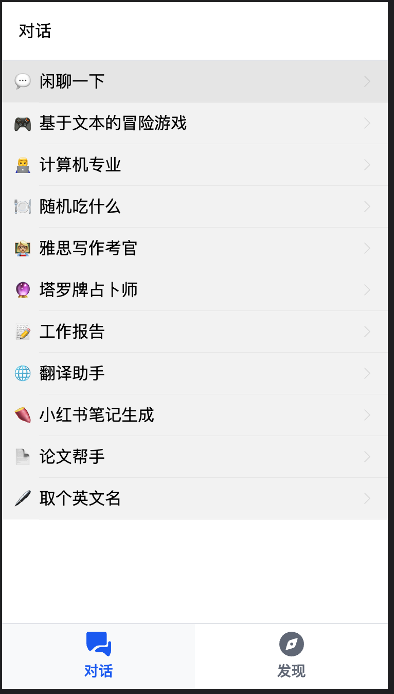
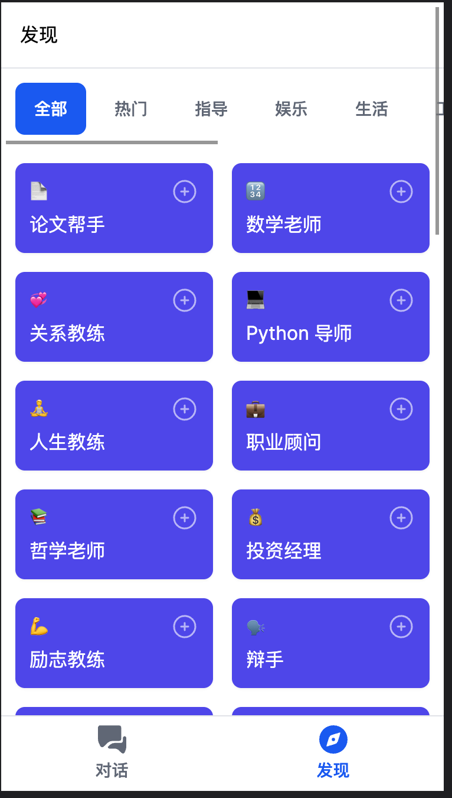
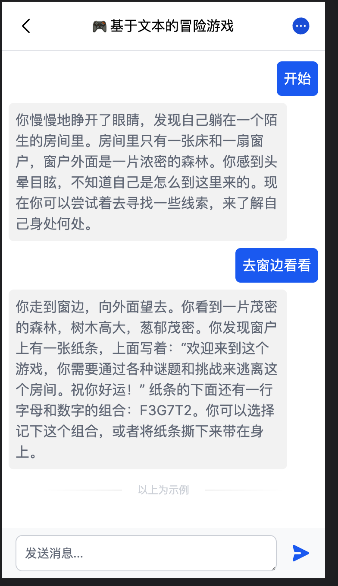
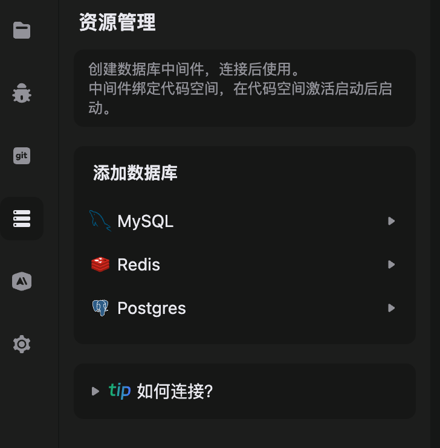
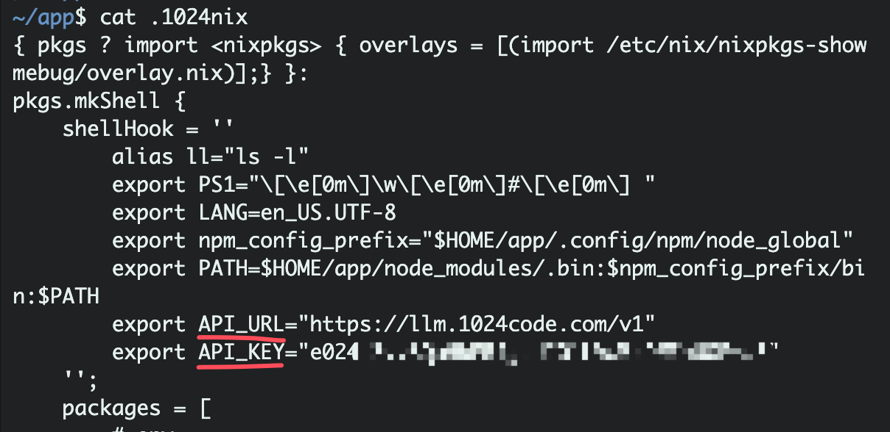
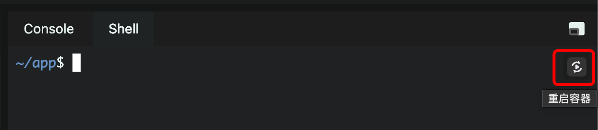

# ChatGPT App With Next.js

基于 Next.js 的 ChatGPT 应用，1024Code 提供了 AI 接口服务，让您立即开始开发您的AI应用。

## 应用介绍

> OreAI 聊天智能助手 AI对话写作

### 对话页

新用户注册成功，会默认自带部分对话。



### 发现页

通过底部导航，切换到 发现页。可以选择不同的提示词新建对话



### 对话详情页

通过 对话页\发现页 进入相应的对话详情页。即可使用～



## 应用实现

OreAI 基于 Next.js 开发，后端层面使用了 prisma 和 GraphQL，数据库使用 1024Code 内置的 mysql，使用 turbo 缓存打包资产。具体实现应用代码在 `apps/web`。

PS: 1024Code 内置的 mysql，如果是新建的代码空间，需要先在资源管理添加



### 内置环境变量

通过修改 `.1024nix` 文件，给当前环境注入环境变量：`API_URL` 、 `API_KEY`



修改完成后，重启容器即可生效



PS: 该方法是在 `AI 接口服务` 内测期间的临时修改方案，后续平台会根据当前用户自动注入。 当前的 `API_KEY` 需要联系运营人员获取，并且默认只有 1000 调用次数，使用完后需再次联系运营人员。

### Next.js 环境变量

在 `apps/web/.env` 文件存储了会在 OreAI 应用中用到的环境变量。

```
NEXT_PUBLIC_API_URL=$API_URL
NEXT_PUBLIC_API_KEY=$API_KEY
DATABASE_URL="mysql://${MYSQL_USER}:${MYSQL_PASSWORD}@${MYSQL_HOST}:${MYSQL_PORT}/ore_ai_db"
```

- NEXT_PUBLIC_API_URL 请求Open AI的URL
- NEXT_PUBLIC_API_KEY 请求Open AI的KEY，需要联系运营人员获取
- DATABASE_URL        prisma 连接数据库的URL

### 对话功能实现

对话详情页的代码在 `apps/web/app/(sub)/chat/[id]/ChatPage.tsx`。以下是实现的关键代码片段，通过 fetchSSE 请求，处理返回的流数据。

```ts
const payload = {
  model: "gpt-3.5-turbo",
  messages: chats,
  temperature: 0.7,
  top_p: 1,
  frequency_penalty: 0,
  presence_penalty: 0,
  max_tokens: 1000,
  stream: true,
  n: 1,
};

let text = "";

fetchSSE(`${process.env.NEXT_PUBLIC_API_URL}/chat/completions`, {
  headers: {
  "Content-Type": "application/json",
  Authorization: `Bearer ${process.env.NEXT_PUBLIC_API_KEY ?? ""}`,
  },
  method: "POST",
  body: JSON.stringify(payload),
  onMessage: (data) => {
  if (!getLoad()) return;
  if (data === "[DONE]") {
    setLoading(false);
    addMessage({
      variables: { chatId, role: Role.ASSISTANT, content: text },
    });
    return;
  }

  try {
    const ret = JSON.parse(data);
    const finish_reason = ret.choices[0].finish_reason;
    const finish = finish_reason === "stop" || finish_reason === "length";
    const content = ret.choices[0].delta.content;
    if (finish) {
      setLoading(false);
    } else if (content) {
      text += content;
      update((prev) => {
        prev[0].content = text;
        return [...prev];
      });
    }
  } catch (error) {
    console.log("error", error);
    setLoading(false);
    update((prev) => {
      prev[0].content = "未知错误";
      prev[0].error = true;
      return [...prev];
    });
  }
  },
}).catch((err) => {
  console.log("error", err);
  setLoading(false);
  update((prev) => {
    prev[0].content = "未知错误";
    prev[0].error = true;
    return [...prev];
  });
});
```


### TODO

- 注册：校验当前邮箱是否已注册
- 对话：处理上下文超过4096 tokens的问题（目前只能清空对话以继续进行）
- 对话：新用户示例对话第一次提问回答异常问题